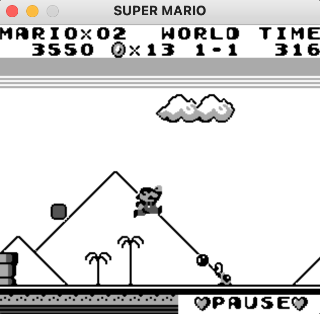

# GB Pymulator

_A gameboy emulator written in Python_

## Installation

This project uses Python3, Pygame for graphics, and Cython for performance optimizations.
(Use PyPy for more performance without C & Cython)

Install dependencies with `pip`:

```bash
pip3 install -r requirements.txt
```

Compile the emulator with Cython:
```bash
./compile_cython.sh
```

## Usage

Start a game:
```bash
./run.py games/super_mario.gb
```

Tips & tricks:
- Configure key-bindings in `key_bindings.json`
- Toggle between color schemes (black-and-white or "retro green") by pressing `C`



